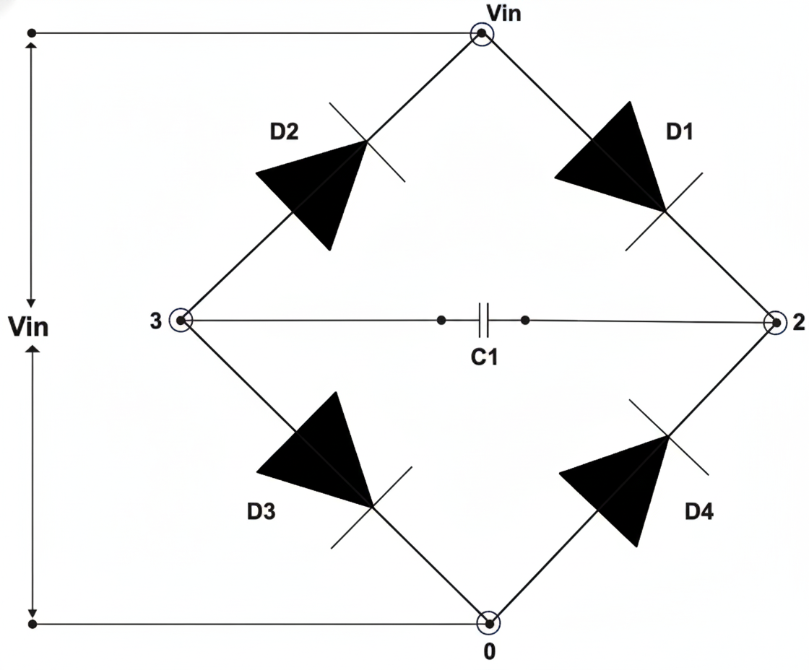
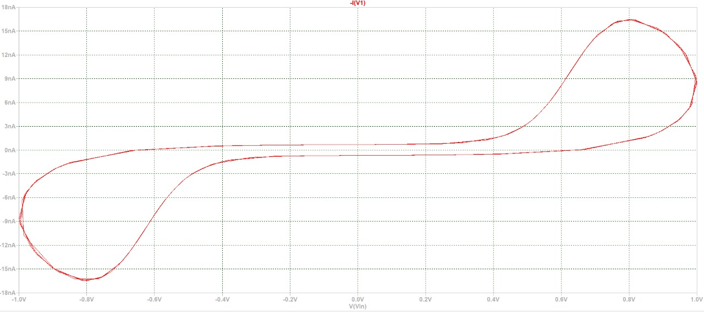
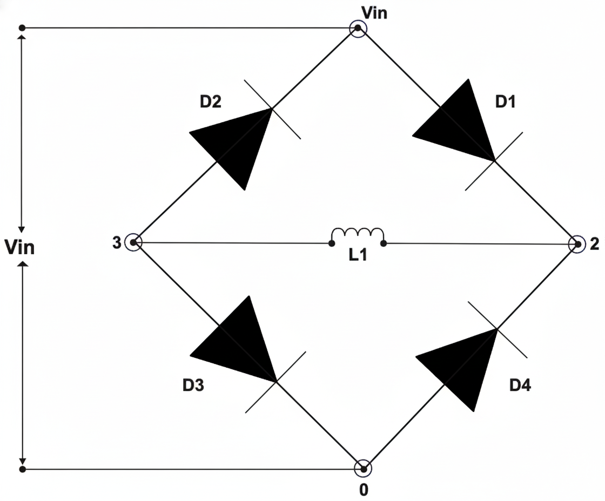
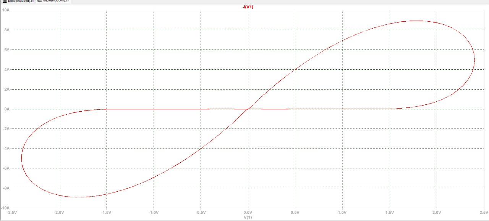
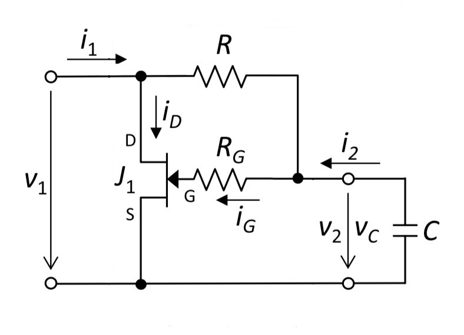
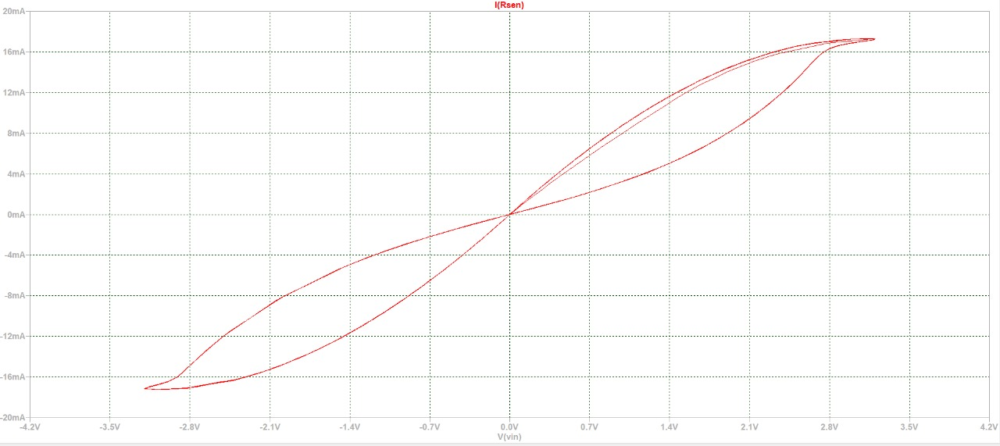

# Mem Element Emulator (LTspice Simulation)

Semester V project on simulating mem-element behaviour using standard circuit components in LTspice. Based on the work by Biolek et al. (IEEE TCAS-II, 2025) and related papers — we implemented the circuits, ran the simulations, and tried to understand *why* the hysteresis forms the way it does, not just that it does.

---

## Background

The core idea is simple: a real memristor is hard to fabricate — it needs nanoscale titanium dioxide structures or similar. But you can get the same electrical behaviour (a pinched hysteresis loop in the V-I plane) using a nonlinear resistive two-port loaded with a capacitor or inductor. That's an emulator.

The paper by Biolek et al. goes deeper than just showing the loop — it derives the exact conditions a two-port must satisfy for the emulated element to qualify as a proper extended memristor (the zero-crossing property). We used this framework to understand each of our circuits.

---

## What we simulated

### 1. Graetz Bridge + Capacitor

Four D1N4148 diodes in a bridge with a 95 pF capacitor across the output port. Driven at 30 Hz.

**Circuit:**



The capacitor stores charge from one half-cycle — that stored charge modifies the next. At low frequencies this produces a pinched hysteresis loop. One thing worth noting from the paper: the zero-crossing property (loop pinching exactly at the origin) holds only when all four diodes are identical. We used D1N4148 throughout to keep the bridge symmetric.

**Simulation result:**



The loop is narrow but clearly pinched at the origin — classic charge-controlled memristive behaviour. Current is in the nanoampere range because the capacitor (95 pF) and frequency (30 Hz) are both very small.

```spice
V1 Vin 0 SIN(0 1 30)
D1 Vin 2 D1N4148
D2 3 Vin D1N4148
D3 3 0 D1N4148
D4 0 2 D1N4148
C1 2 3 95pF
.model D1N4148 D(IS=2.52e-9 N=1.9 BV=100 IBV=0.1 CJO=4.0e-12 M=0.333 TT=4e-9)
.tran 0 0.3 0.05 50u
```

---

### 2. Graetz Bridge + Inductor

Same bridge, capacitor replaced with a 1 mH inductor. 1N4007 diodes, driven at 12.15 Hz.

**Circuit:**



Inductors store magnetic flux rather than charge. Since current through an inductor can't change instantaneously, the memory effect is stronger — and the loop gets wider. The state variable here is the inductor flux, not charge.

**Simulation result:**



Significantly wider loop compared to the capacitor case — confirms that flux-controlled memory is stronger and longer-lasting than charge-based memory. The loop area directly reflects the depth of memory.

```spice
V1 Vin 0 SIN(0 2.4 12.15)
D1 Vin 2 1N4007
D2 3 Vin 1N4007
D3 3 0 1N4007
D4 0 2 1N4007
L1 2 3 1m
.model 1N4007 D()
.tran 0 0.3 0.05 50
```

---

### 3. JFET-based Emulator

A J310 JFET with supporting resistors (R = RG = 1 MΩ) and a 1.48 nF capacitor. No diode bridge here.

**Circuit:**



The JFET's channel resistance varies with gate voltage. The capacitor charges gradually with the input signal, which shifts the gate bias — giving the device a history-dependent resistance. That's the memory mechanism here.

Technically, the paper shows the JFET circuit doesn't strictly satisfy the zero-crossing condition the way the symmetric diode bridge does. But the deviation is in the picoampere range — immeasurably small in practice. The loop still pins at the origin and all memristive fingerprints are present.

**Simulation result:**



Smoother loop shape compared to the passive stages — because here the resistance change is governed by semiconductor physics (gradual channel modulation) rather than abrupt diode switching. Also tunable: changing R adjusts the loop shape.

```spice
V1 Vin 0 SIN(0 3.2 120)
Rsen Vin 1 10
R1 1 2 1Meg
RG 2 G 1Meg
C1 2 0 1.48n
J1 1 G 0 J310_MODEL
.model J310_MODEL NJF (VTO=-2.5 BETA=2m IS=1e-12 LAMBDA=0.02 CGS=2p CGD=2p)
.tran 0 40m 0
```

---

## Results comparison

| Configuration | Loop shape | Current scale | Memory mechanism |
|---|---|---|---|
| Bridge + Capacitor | Narrow, pinched | nA range | Charge storage (state = q_C) |
| Bridge + Inductor | Wide, prominent | A range | Flux storage (state = φ_L) |
| JFET | Smooth, S-shaped | mA range | Channel resistance modulation |

All three produce a pinched hysteresis loop — the standard fingerprint of mem-element behaviour as defined by Chua and verified experimentally in the Biolek paper.

---

## How to run

1. Install LTspice (free, Analog Devices)
2. Open any `.cir` file from `netlists/`
3. Press Run (F5)
4. For V-I hysteresis: right-click waveform → Add Trace
   - Capacitor/Inductor: X-axis = `V(2,3)`, Y-axis = `I(V1)`
   - JFET: X-axis = `V(vin)`, Y-axis = `I(Rsen)`

---

## References

- D. Biolek, Z. Kolka, V. Biolkova, Z. Biolek, Z. Kohl — "Modeling and Emulation of Extended Memristors: Two-Port Approach Revisited," *IEEE Trans. Circuits Syst. II*, vol. 72, no. 1, Jan. 2025
- F. Corinto, A. Ascoli — "Memristive diode bridge with LCR filter," *Electronics Letters*, 2012
- J. Sadecki, W. Marszalek — "Analysis of a memristive diode bridge rectifier," *Electronics Letters*, 2019
- R. Senani — "New single-capacitor simulations of floating inductors," *Electrocomponent Science and Technology*, 1982
- L. O. Chua, S. M. Kang — "Memristive Devices and Systems," *Proc. IEEE*, 1976
- S. P. Adhikari et al. — "Three fingerprints of memristor," *IEEE Trans. Circuits Syst. I*, 2013

---

B.Tech ECE, Semester V — Faculty of Technology, University of Delhi  
Supervised by Prof. Raj Senani and Dr. Khushwant Sehra
